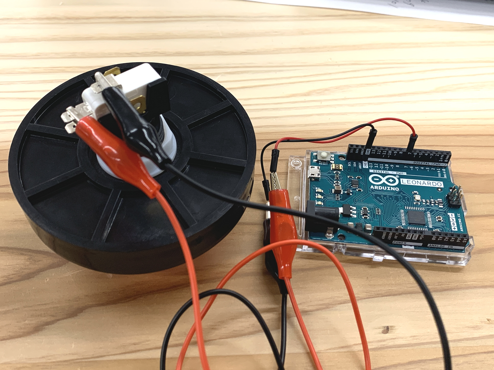
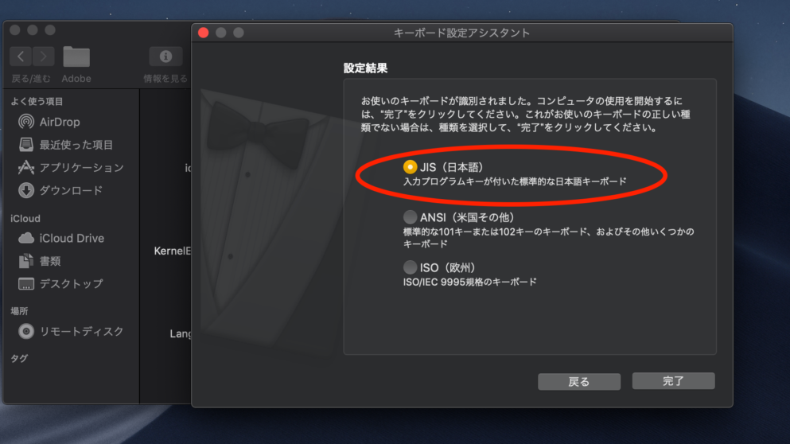

# LinkingRecordings

# __レコードのモードについて__
## __yamada_tape1.pde__
Rを奇数回押したとき：録音

Rを偶数回押したとき：ループ再生
## __yamada_tape2.pde__
Rを押している最中：録音

Rを離したとき：ループ再生  
# __録音ファイルの再利用機能について__
これまで、録音したデータは、プログラムの停止を行うと、もう一度実行した時に消えている(上書きしてしまう)仕様になっていました。

今回のアップデートにより、一度プログラムの停止をしても、再度実行した際に既に録音したデータが再生されるようになりました。

## __録音ファイルへのアクセスについて__
それに伴い、ファイルパスの扱いに環境依存が含まれるようになりました。
yamada_tape.pde, yamada_tape2.pdeの2種における116行目で

    file_name = "Documents/WORK/LinkingRecordings/yamada_tape/data/myrecording" + i + ".wav";

もしくは

    file_name = "Documents/WORK/LinkingRecordings/yamada_tape2/data/myrecording" + i + ".wav";

という記載があります。これは既に録音したデータにアクセスするために、録音データまでのパスを明記していますが、データの位置はそれぞれのPCの環境によって異なります。

仕様上、Processingのファイル探索はまず**ホームディレクトリ**
から始まります。使用者のホームディレクトリを確認するには、ターミナル上でcdと入力後、lsと入力します。

例えば次のような表示になります。

    % cd //ホームディレクトリに移動
    % ls //ホームディレクトリの内容を表示

    Applications		Downloads		Pictures
    Creative Cloud Files	Dropbox			Public
    Desktop			Library			hs_err_pid43741.log
    Development		Movies			processing-java
    Documents		Music

先ほどの

        file_name = "Documents/WORK/LinkingRecordings/yamada_tape/data/myrecording" + i + ".wav";

の場合、ホームディレクトリの中のDocumentの中のWORKの中のLinkingRecordings...となります。

例えば、DesktopにLinkingRecordingsをダウンロードした場合、

        file_name = "Desktop/LinkingRecordings/yamada_tape/data/myrecording" + i + ".wav";

となります。
**LinkingRecordings以降のパス表記はどのディレクトリに置いた場合にも(下記：注意の欄を除いて)変更はありません。**

### __注意__
yamada_tape.pdeとyamada_tape2.pdeでアクセスするディレクトリが異なります。

    ~/LinkingRecordings/yamada_tape/~

もしくは

    ~/LinkingRecordings/yamada_tape2/~

となることに注意してください。

# __外部ボタンとの接続について__
外部ボタンによる録音機能を追加しました。

それに伴った環境設定について説明します。

## __Arduinoについて__
Arduino LeonardのHIC機能を用いて、外部ボタンをキーボードとして認識させています。よって、**HIC機能がないArduino Unoでは動作しない**ことに注意してください。

## __セットアップについて__
7番ポートを使用しています。以下の画像を参考に、7番ポートとGNDを外部ボタンに接続してください。

## __キーボード設定アシスタントについて__
外部ボタンを接続するにあたって、Macの「キーボード設定アシスタント」からArduinoを登録する必要があります。表示されるポップアップに沿って設定を行なってください。

また以下の画像のような、キーボード種類を選択する画面では**必ずJIS**を選択してください。他のキーボードで設定した場合、違う文字として認識され。動作しない場合があります。

